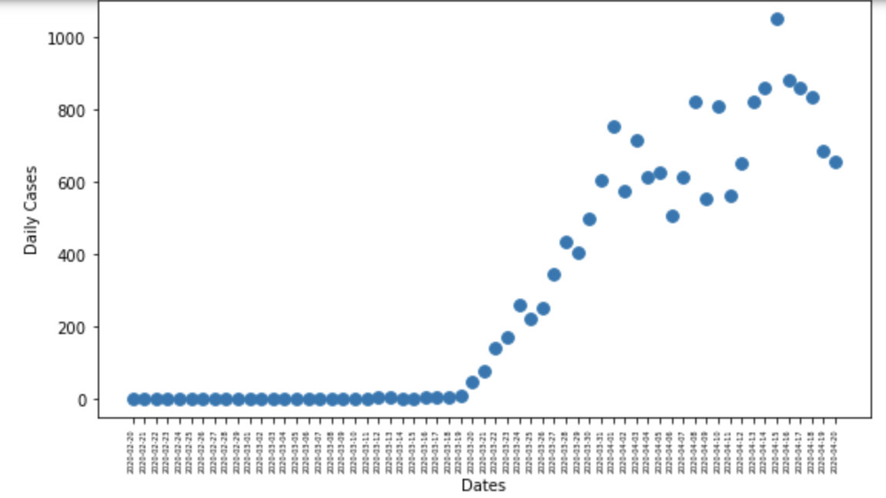
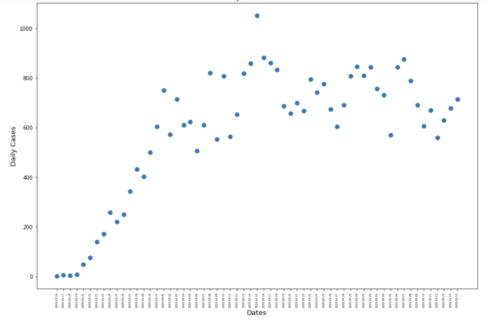
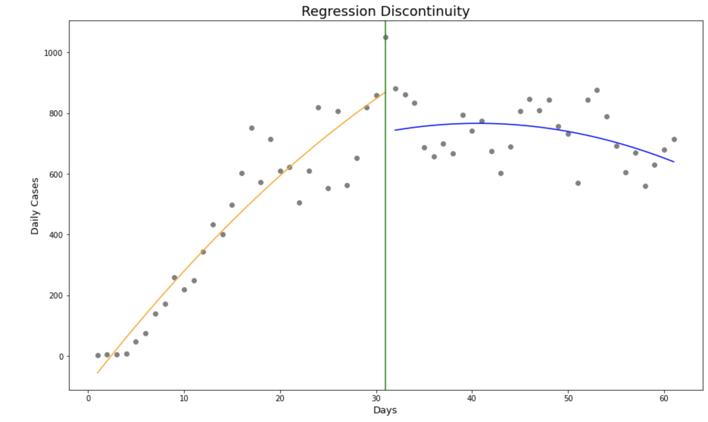

## 🔸 March 20, 2020 Lockdown 🔸
#### Regression Discontinuity Design

## 🏆 Goal

To use RDD to estimate the effect of the the 20/3/2020 lockdown in Quebec.

## 📈 Data Source:
https://github.com/ccodwg/CovidTimelineCanada/tree/main/data/pt

The link provides all the data of Canada through out the timeline of the Covid.
We extracted all relevant data of Quebec starting January 23, 2020 until January 31, 2021 and combined them into one dataset.

## ☑️ Steps
The focus of our work is only on the daily Covid cases. We have also decided to make a window of 60 days because symptoms may appear 2-14 days after exposure to the virus.

 1. Extracted all the indices that contained the relevant dates needed.
 2. Assigned date as our independent variable (x) and daily cases as our dependent variable (y).
 3. Plotted the data in a scatter plot.
 4. Assigned a cutoff predictor.
 5. Added a new column named "day" as cardinal numbers to make it easier to plot and perform a regression on.
 6. Transformed the data and performed a Regression Discontinuity.
 7. Plotted the Final Regression Discontinuity Model.

## 📊 Data Visualization
### Daily Covid Cases

Just by looking at the dataset, we can say that people were already getting tested for Covid however, we can not conclude any result of the tests. For the first quarter of the year there were no records of daily cases.

Since, it is hard to see if the lockdown actually had a positive or negative effect. We have decided to lag the data by 3 weeks to see more visible changes given that more data is provided on the second quarter.

### Visualization from March 16, 2020 to May 15,2020.

Assigned a cutoff predictor of April 15, 2020.
 Added Polynomial Feature

## ⭐ Conclusion
Given the lag date of April 15, 2020, we can conclude that the lockdown has decreased the cases of Covid reported daily in Quebec. By looking at the summary we can see that there is statiscal significance with the day and the intercept having Pvalues lower than 0.05. 
